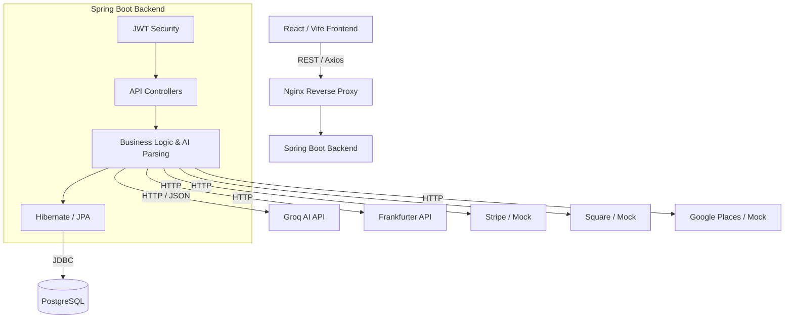
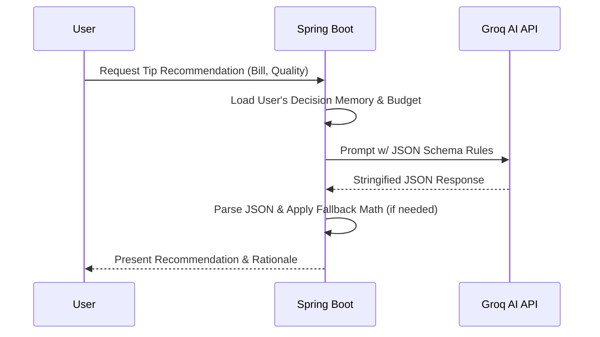
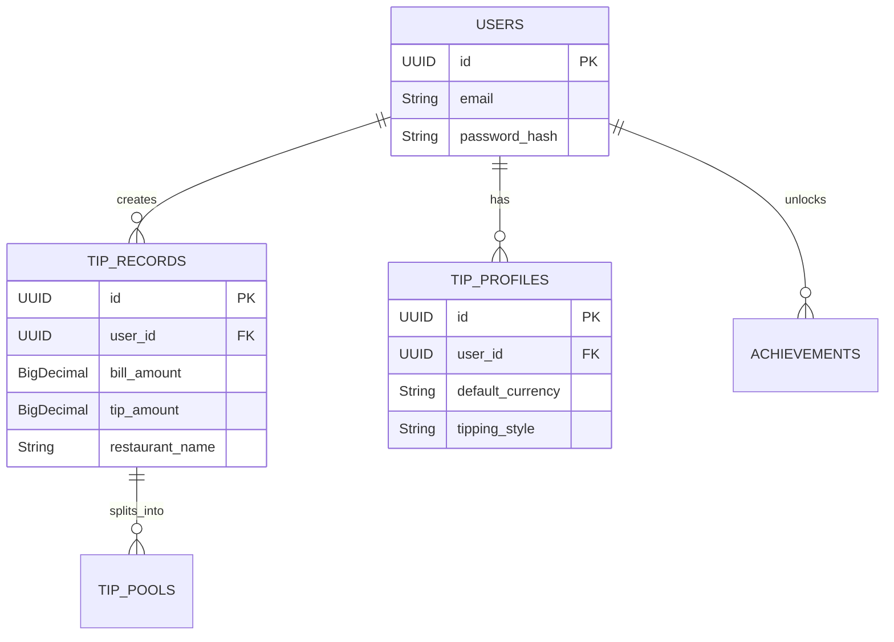
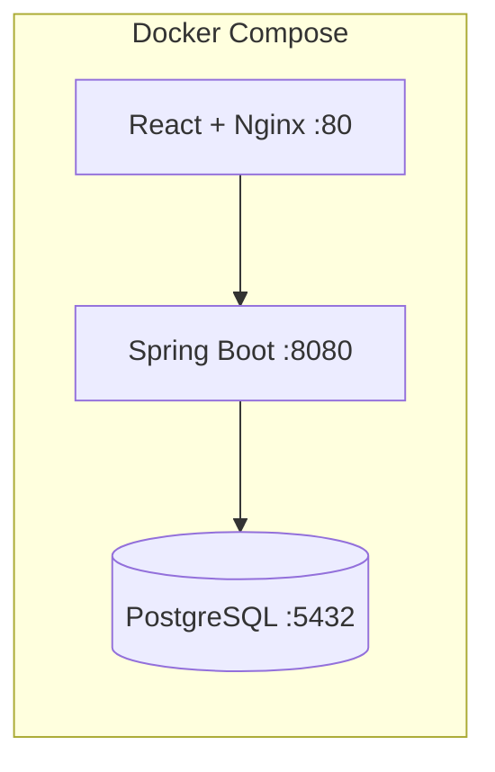

# AI Tip Assistant 🚀

## 🚀 Project Overview
A comprehensive, full-stack application designed to completely reimagine the tipping experience. Built with a modern **React/Vite** frontend and a robust **Spring Boot (Java)** backend, this application leverages **Google Groq AI** to provide users with context-aware, highly personalized tipping recommendations based on historical data, budget constraints, and real-time service quality evaluations.

## ✨ Key Features
- **Smart Tip AI & Decision Memory 🧠**: Generates intelligent tipping recommendations via Google Groq AI, learning from user habits over time to adapt to conservative, moderate, or generous profiles.
- **Comprehensive Financial Tracking 📊**: Tracks spending analytics via dynamic Recharts graphs, sets monthly tipping budgets, and forecasts future expenses.
- **Receipt OCR Integration 📸**: Uses AI Vision to parse receipts and automatically extract subtotals, restaurant names, and currencies.
- **Advanced Tipping Mechanics 💡**: Supports tip pools, tax-aware calculations (pre-tax vs post-tax), and custom generosity scoring.
- **Gamification & Profiles 🏆**: Features an achievement system rewarding consistent tipping behaviors.

## 🏗️ Architecture



## 🔄 Application Flow
1. **User Authentication**: The user registers or logs in securely. JWTs handle stateless sessions.
2. **Data Input**: The user inputs a bill amount or uses the Tip Calculator for group splitting.
3. **AI Context Building**: The backend gathers the user's historical tips, current budget limits, and personal preferences (Decision Memory).
4. **Groq AI Request**: The backend prompts Groq AI with a structured schema.
5. **Smart Recommendation**: Groq AI responds with an exact tip amount and rationale, parsed robustly back into the UI.
6. **Data Persistence**: The final selected tip is saved to the PostgreSQL database, influencing the next AI recommendation.

## 🤖 AI / Groq Integration



## 🔐 Authentication & Security
- **JWT (JSON Web Tokens)**: Secure, stateless authentication enforcing strong expiration policies.
- **Multi-Tenant Isolation**: Rigorous Anti-IDOR checks ensure users can never query, modify, or leak another user's tipping history.
- **Environment Isolation**: API keys are injected at runtime via environment variables; nothing is hardcoded in the repository.

## 🗄️ Database Design



## 🐳 Docker Setup


The application is fully containerized. A single `docker-compose up` orchestrates the Postgres database (with Flyway migrations), the Spring Boot backend, and the Nginx-served React frontend.

## 🧪 Testing
Built with an absolute emphasis on stability:
- **Backend Tests**: 784/784 passing tests using JUnit 5 and Mockito, ensuring bulletproof logic and AI failure fallbacks.
- **Frontend E2E**: Playwright suite verifying the complete user journey (registration, calculation, history, AI recommendations).

## 🔌 External Integrations
A flexible, interface-driven architecture allows toggling between Real APIs and Mock Providers based on environment configuration:
- **Groq AI**: Real (Requires `GROQ_API_KEY`)
- **Currency**: Real (Frankfurter API)
- **Stripe Payments**: Mock by default (Switchable via `app.payment.provider`)
- **Square POS**: Mock by default (Switchable via `app.pos.provider`)
- **Google Places**: Mock by default (Switchable via `app.restaurant.provider`)

## 🖥️ Screenshots
*(Screenshots can be added to the `docs/` folder. Placeholders provided below)*

| Tip Dashboard | Smart Calculator |
| :---: | :---: |
|  |  |

## ⚙️ Local Setup

**1. Clone & Setup Database**
Ensure PostgreSQL is running locally on port 5432 with a database named `aitip_db`.

**2. Backend Setup**
```bash
cd backend
# Set your Groq API key through the GROQ_API_KEY environment variable.
# Do not place API keys directly in application.yml or commit them to Git.
export GROQ_API_KEY="your_key_here"
export JWT_SECRET="your_32_byte_secret_here"
mvn clean install
mvn spring-boot:run
```

**3. Frontend Setup**
```bash
cd frontend
npm install
npm run dev
```

## 🔑 Environment Variables
Never commit real secrets. For local development, set these in your shell or CI/CD pipeline:
- `GROQ_API_KEY`: Required for AI features.
- `JWT_SECRET`: Required for user authentication.
- `DB_USER` / `DB_PASSWORD`: PostgreSQL credentials.

## 📊 Acceptance Results
| Area | Status | Evidence |
| ---- | ------ | -------- |
| Unit Tests | COMPLETE | 784/784 Maven tests passing |
| E2E Testing | COMPLETE | 10/11 Playwright tests passing (1 skipped) |
| Security | COMPLETE | 0 Hardcoded secrets in repository |
| Builds | COMPLETE | Vite build succeeds, Spring Boot JAR succeeds |

## 🛣️ Future Improvements
- Implement the Frontend UI for Receipt OCR (Backend endpoint is verified).
- Expand E2E testing to cover external mock edge cases.
- Transition external Mocks (Stripe/Square) to fully sandboxed integrations in the staging environment.
