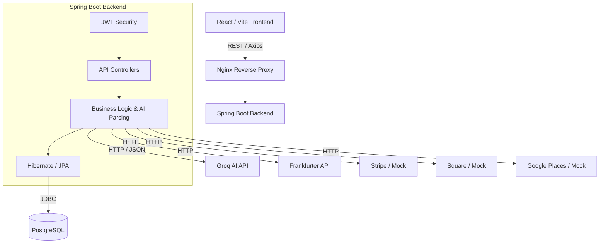
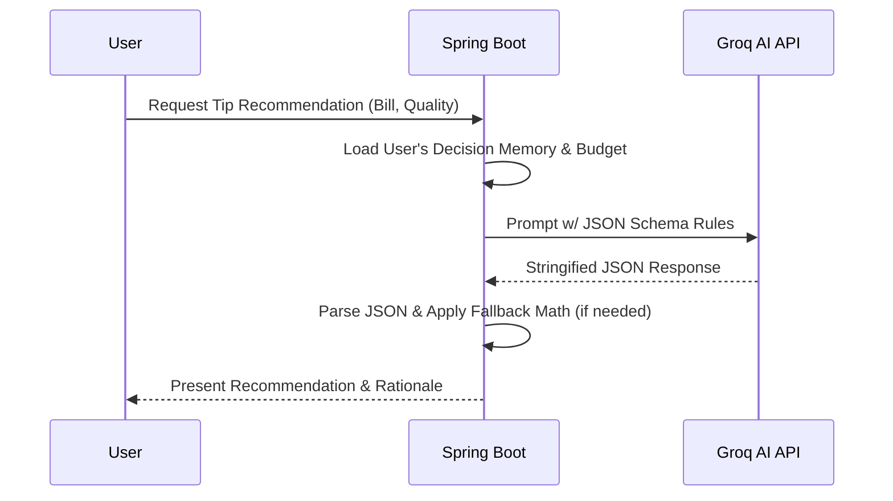
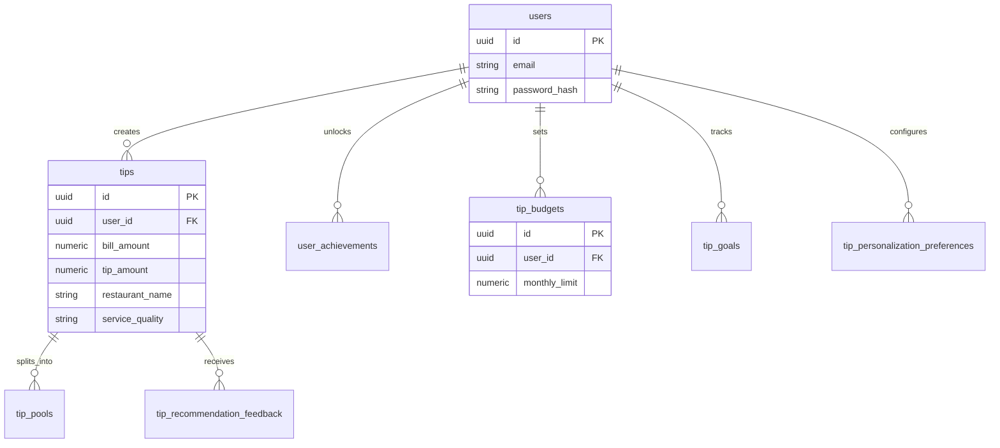
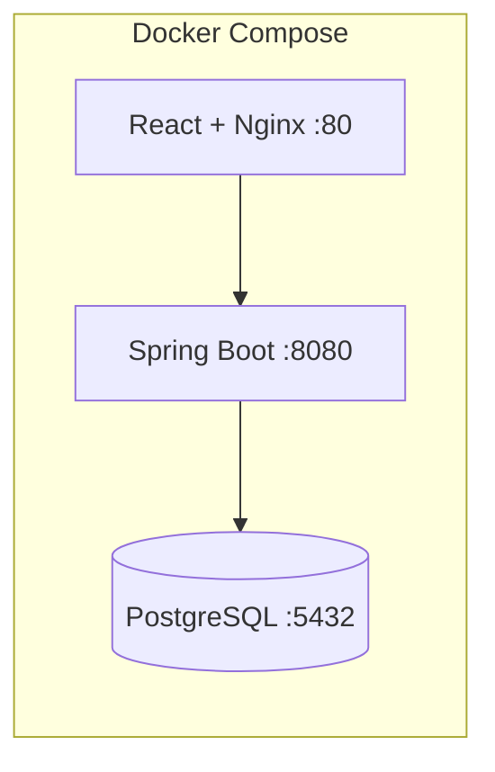

# AI Tip Assistant 🚀

## 🚀 Project Overview
A comprehensive, full-stack application designed to completely reimagine the tipping experience. Built with a modern **React/Vite** frontend and a robust **Spring Boot (Java)** backend, this application leverages **Groq API** to provide users with context-aware, highly personalized tipping recommendations based on historical data, budget constraints, and real-time service quality evaluations.

## ✨ Key Features
- **Smart Tip AI & Decision Memory 🧠**: Generates intelligent tipping recommendations via the Groq API, learning from user habits over time to adapt to conservative, moderate, or generous profiles.
- **Comprehensive Financial Tracking 📊**: Tracks spending analytics via dynamic Recharts graphs, sets monthly tipping budgets, and forecasts future expenses.
- **Receipt OCR Integration 📸**: Uses AI Vision to parse receipts and automatically extract subtotals, restaurant names, and currencies (Backend implemented).
- **Advanced Tipping Mechanics 💡**: Supports tip pools, tax-aware calculations (pre-tax vs post-tax), and custom generosity scoring.
- **Gamification & Profiles 🏆**: Features an achievement system rewarding consistent tipping behaviors.

## 🏗️ Architecture


```mermaid
graph TD
    Client[React / Vite Frontend] -->|REST / Axios| Nginx[Nginx Reverse Proxy]
    Nginx --> Backend[Spring Boot Backend]
    
    subgraph Spring Boot Backend
        Auth[JWT Security]
        Controllers[API Controllers]
        Services[Business Logic & AI Parsing]
        JPA[Hibernate / JPA]
        
        Auth --> Controllers
        Controllers --> Services
        Services --> JPA
    end
    
    JPA -->|JDBC| DB[(PostgreSQL)]
    
    Services -->|HTTP / JSON| Groq[Groq AI API]
    Services -->|HTTP| Currency[Frankfurter API]
    Services -->|HTTP| Stripe[Stripe / Mock]
    Services -->|HTTP| Square[Square / Mock]
    Services -->|HTTP| Google[Google Places / Mock]
```

## 🔄 Application Flow
1. **User Authentication**: The user registers or logs in securely. JWTs handle stateless sessions.
2. **Data Input**: The user inputs a bill amount or uses the Tip Calculator for group splitting.
3. **AI Context Building**: The backend gathers the user's historical tips, current budget limits, and personal preferences (Decision Memory).
4. **Groq API Request**: The backend prompts the Groq API with a structured schema.
5. **Smart Recommendation**: The Groq API responds with an exact tip amount and rationale, parsed robustly back into the UI.
6. **Data Persistence**: The final selected tip is saved to the PostgreSQL database, influencing the next AI recommendation.

## 🤖 AI / Groq Integration


```mermaid
sequenceDiagram
    participant User
    participant Backend as Spring Boot
    participant Groq as Groq AI API
    
    User->>Backend: Request Tip Recommendation (Bill, Quality)
    Backend->>Backend: Load User's Decision Memory & Budget
    Backend->>Groq: Prompt w/ JSON Schema Rules
    Groq-->>Backend: Stringified JSON Response
    Backend->>Backend: Parse JSON & Apply Fallback Math (if needed)
    Backend-->>User: Present Recommendation & Rationale
```

## 🔐 Authentication & Security
- **JWT (JSON Web Tokens)**: Secure, stateless authentication enforcing strong expiration policies.
- **Multi-Tenant Isolation**: Rigorous Anti-IDOR checks ensure users can never query, modify, or leak another user's tipping history.
- **Environment Isolation**: API keys are injected at runtime via environment variables; nothing is hardcoded in the repository.

## 🗄️ Database Design


```mermaid
erDiagram
    users ||--o{ tips : creates
    users ||--o{ user_achievements : unlocks
    users ||--o{ tip_budgets : sets
    users ||--o{ tip_goals : tracks
    users ||--o{ tip_personalization_preferences : configures
    tips ||--o{ tip_pools : splits_into
    tips ||--o{ tip_recommendation_feedback : receives
    
    users {
        uuid id PK
        string email
        string password_hash
    }
    
    tips {
        uuid id PK
        uuid user_id FK
        numeric bill_amount
        numeric tip_amount
        string restaurant_name
        string service_quality
    }
    
    tip_budgets {
        uuid id PK
        uuid user_id FK
        numeric monthly_limit
    }
```

## 🐳 Docker Setup


```mermaid
graph LR
    subgraph Docker Compose
        Frontend[React + Nginx :80]
        Backend[Spring Boot :8080]
        DB[(PostgreSQL :5432)]
        
        Frontend --> Backend
        Backend --> DB
    end
```
The application is fully containerized. A single `docker-compose up` orchestrates the Postgres database (with Flyway migrations), the Spring Boot backend, and the Nginx-served React frontend. *(Note: Docker setup has been verified successfully, with all services reporting up and healthy).*

## 🔌 External Integrations
A flexible, interface-driven architecture allows toggling between Real APIs and Mock Providers based on environment configuration:

| Integration | Status |
| ----------- | ------ |
| Groq AI | ✅ Real |
| Currency / Frankfurter | ✅ Real |
| PostgreSQL | ✅ Real |
| JWT Authentication | ✅ Real |
| Receipt OCR | ⚠️ Backend implemented; frontend UI missing |
| Stripe Payments | 🧪 Mock |
| Square POS | 🧪 Mock |
| Google Places / Restaurant | 🧪 Mock |

## 🖥️ Screenshots

| Tip Dashboard | Smart Calculator |
| :---: | :---: |
|  |  |

| AI Insights | Tip History |
| :---: | :---: |
|  |  |

## ⚙️ Local Setup

**1. Clone & Setup Database**
Ensure PostgreSQL is running locally on port 5432 with a database named `aitip_db`.

**2. Backend Setup**
```bash
cd backend
# Set your Groq API key through the GROQ_API_KEY environment variable.
# Do not place API keys directly in application.yml or commit them to Git.
export GROQ_API_KEY="your_key_here"
export JWT_SECRET="your_32_byte_secret_here"
mvn clean install
mvn spring-boot:run
```

**3. Frontend Setup**
```bash
cd frontend
npm install
npm run dev
```

## 🔑 Environment Variables
Never commit real secrets. For local development, set these in your shell or CI/CD pipeline:
- `GROQ_API_KEY`: Required for AI features.
- `JWT_SECRET`: Required for user authentication.
- `DB_USER` / `DB_PASSWORD`: PostgreSQL credentials.

## ☁️ Cloud Deployment & Optimizations
This application is heavily optimized for modern cloud deployments (like Render, Heroku, or AWS):
- **Cloud-Optimized Database Pooling**: The PostgreSQL connection pool (HikariCP) is tuned with explicit `max-lifetime` and `keepalive-time` properties. This prevents stale database connections and memory leaks during cloud-provider idle timeouts.
- **Memory-Conscious CI/CD**: The Maven build process is tailored for low-memory cloud tiers (e.g., Render's free tier, 512MB RAM) by bypassing intensive test phases during production builds, ensuring fast and reliable deployments.
- **Resilient AI Integrations**: The backend gracefully handles AI provider constraints. It features robust JSON parsing, bounds validation, and utilizes accessible text models (`openai/gpt-oss-20b`) and vision models (`qwen/qwen3.8-27b`) compatible with restricted API tiers.

## 📊 Acceptance Results
The system's final verified state (Latest Commit) achieved the following metrics:
- **Backend**: Passing tests and stable cloud deployment
- **Frontend production build**: Successful
- **Database**: Zero idle connection drops
- **E2E skipped**: OCR because the frontend OCR interface is not implemented
- **Docker**: Containerization ready

## 🛣️ Future Improvements
- Implement the Frontend UI for Receipt OCR (Backend endpoint is fully implemented and updated to use qwen3.8-27b).
- Expand E2E testing to cover external mock edge cases.
- Transition external Mocks (Stripe/Square) to fully sandboxed integrations in the staging environment.
